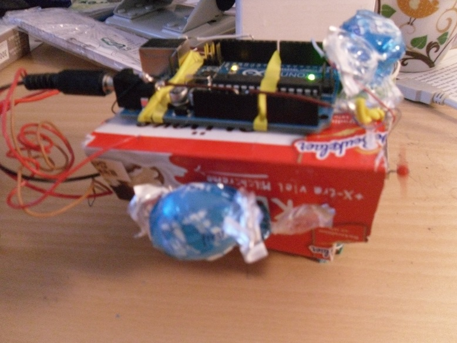

Arduino
=======

Arduinos sind kleine programmierbare Rechner, mit denen man Schaltungen erstellen und Roboter Programmieren kann. Dieses Verzeichnis enthält viele Quellcodes zu unterschiedlichen Schaltungen.

Es gibt sie von vielen verschiedenen Anbieter zb. Elegoo oder Sunfounder und man kann auch seinen eigenen bauen da Arduino größtenteils Open-Source ist.

Mit Arduinos lassen sich verschiedene Projekte sowohl im Internet of Things als auch im Hardware bereich realisieren je nach Zusatzbauteilen die nicht speziell für Arduinos gebaut sind und deshalb in jedem Elektronikhandel verfügbar sind.
