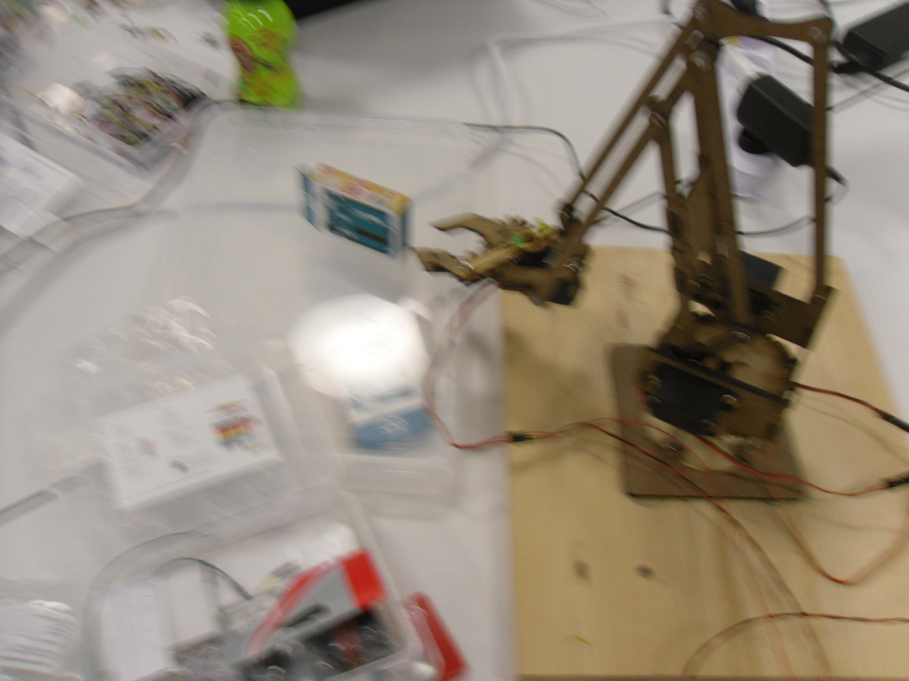

Der Roboterarm ist im Mai im Coder Dojo programmiert worden. Baupläne sind hier: [https://github.com/niccokunzmann/mearm](https://github.com/niccokunzmann/mearm)

Es gibt einen [Film SDC11923.AVI](https://github.com/CoderDojoPotsdam/projects/raw/master/Arduino/roboterarm/SDC11923.AVI) dazu.