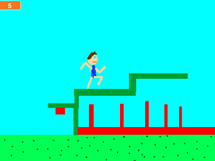

Platform-Bob
============

  
Das Spiel wurde von Alexander Beloseikins bei einem Coder Dojo geschrieben.
Die Datei [Platform-Bob.sb](Platform-Bob.sb) kann heruntergeladen werden und mit Scratch ausgeführt werden. Der Nachfolger ist das Controller-Game mit Makey Makey.

Außerdem haben wir es mit zur [Auszeichnung](https://www.technologiestiftung-berlin.de/de/bibliothek/multimedia/media/ausgezeichnetes-hacken/) der [Hackingbox](https://www.technologiestiftung-berlin.de/de/top-themen/work/hacking-box/) genommen. Dabei ist dieses Bild entstanden:

Rechte daran hat "Deutschland - Land der Ideen/Bernd Brundert", siehe [Veranstaltungsgalerie](https://www.technologiestiftung-berlin.de/de/top-themen/work/hacking-box/).
