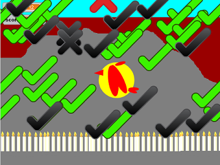
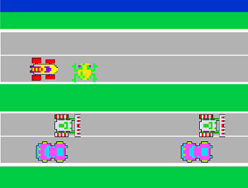
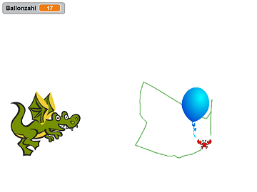
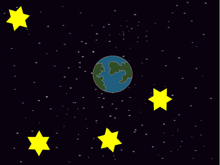
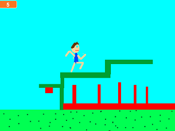
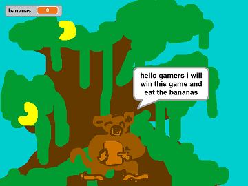
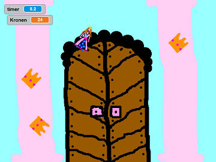
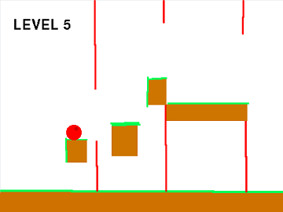
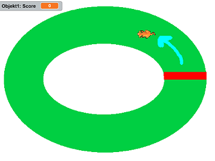

Scratch Spiele
==============

Online
------

  

Offline
-------

  

  

Scratch Installieren
--------------------

[Hier wird gezeigt, wie Scratch 2 installiert werden kann.](https://scratch.mit.edu/scratch2download/)  
Wenn Scratch 2 nicht geht, kann auch Scratch 1 installiert werden. Bei Ubuntu ist das standartmäßig im Paketmanager auffindbar.

----

Die Bilder sollten 360px*270px sein.

