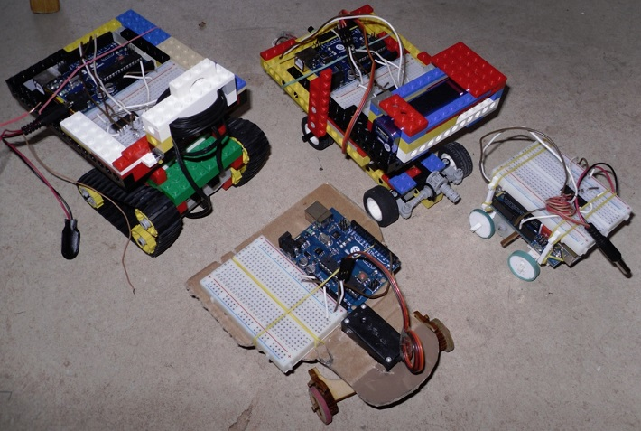
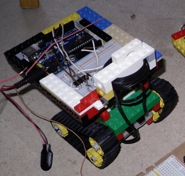
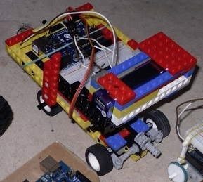
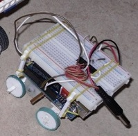
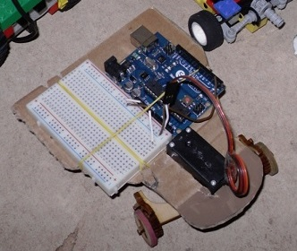

Roboter
=======

Diese Roboter gibt es beim [Coder Dojo Potsdam](http://zen.coderdojo.com/dojo/861).

Das Kettenfahrzeug
------------------

Das Auto
--------

Der Johnroboter
---------------

Der Rödelroboter
----------------

